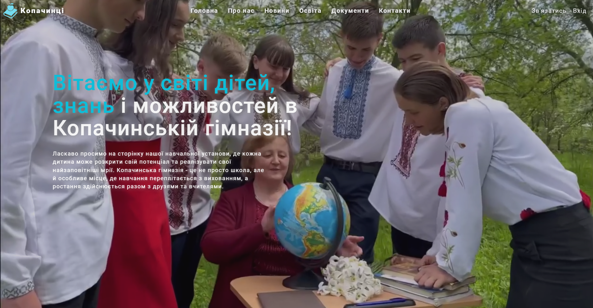
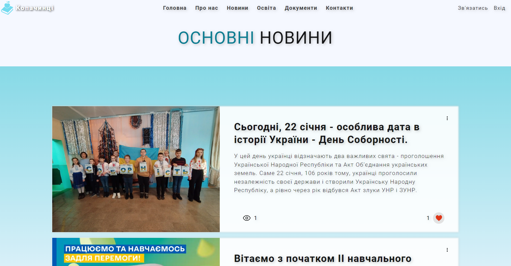
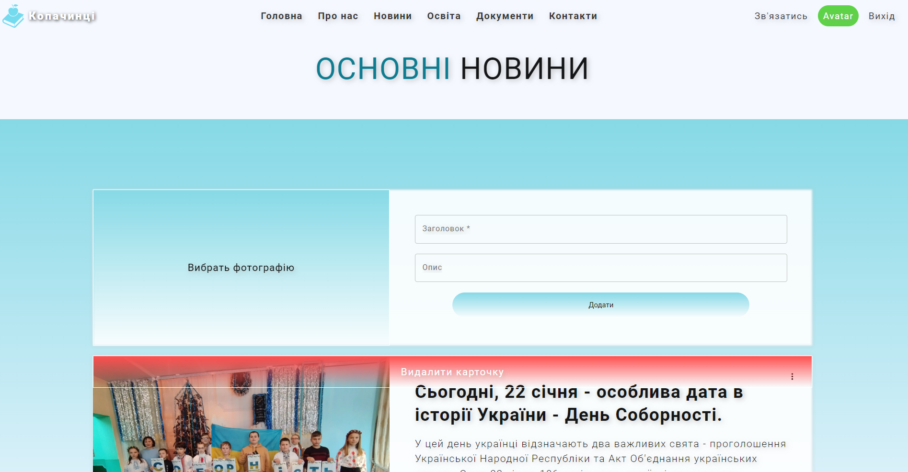

<a id="up"></a>
# Сайт школа | CSM 🕵️

#### ❗❗❗ Проект не завершений. 😕❗❗❗

Проект розроблено для полегшення ведення шкільного контенту на сайті. 🏫
На сайті присутні такі сторінки:
- Головна 🏠
- Про нас ℹ️
- Новини 📰
- Освіта 🎓
- Документи 📄
- Контакти 📞
- Вхід 🔐

---

Для наповнення сайту вмістом було розроблено CMS. 
Адміністратор виконує вхід на сайт та отримує змогу редагувати наступні сторінки:
- Головна
  - Додавання/Видалення фотографій до галереї 📷
- Про нас
  - Додавання/Видалення робочого колективу 👥
- Новини
  - Додавання/Видалення/Редагування постів та оголошень ✍️
- Освіта
  - Розклад уроків
    - Додавання/Видалення документа (розклад) для старших та молодших класів 📅
  - Гуртки
    - Додавання/Видалення документа (про гуртки) 🎨
- Документи
  - Додавання/Видалення документів (відкрите ведення) 📝

## Встановлення та запуск 🎮


 ```
 npm install
 npm run start
 
 ```

## Використання ☝️

Для використання проекту нам потрібно вказати шлях до [back-end частини](https://github.com/Andriy-1/school-back-end).
У файлі, що знаходиться у директорії проекту `src/api/index.ts`, потрібно замінити рядок `http://address/api` на шлях до розміщеного та запущеного [back-end](https://github.com/Andriy-1/school-back-end).


```
import axios from 'axios';

const instance = axios.create({
  baseURL: 'http://address/api',
});

instance.interceptors.request.use((config: any) => {
  const token = localStorage.getItem('token');
  if (token) {
    config.headers.Authorization = token;
  }
  return config;
});

export default instance;
```

## Зображення проекту 📽️🖼️

#### Сторінка "Головна 🏠" без підключення back-end
  - 

#### Сторінка "Новини 📰" без підключення back-end
  - 

#### Сторінка "Про нас ℹ️" імітація входу. Вигляд від імені адміністратора.
  - 

#### Сторінка "Новини 📰" імітація входу. Вигляд від імені адміністратора.
  - 

## [👆 Вверх 👆](#up)
